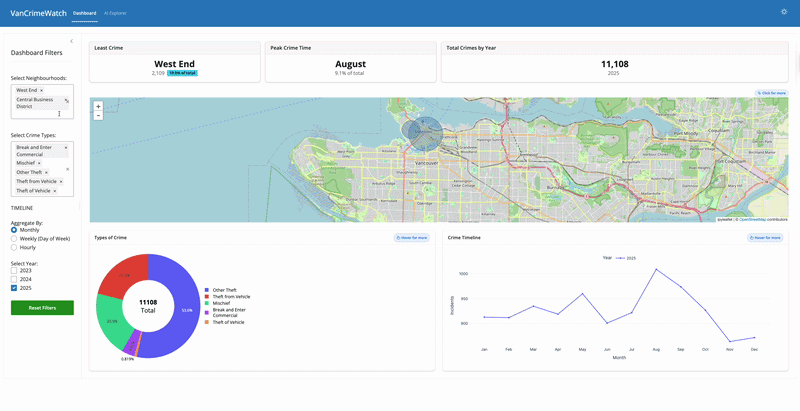

# VanCrimeWatch Dashboard

> Interactive geospatial dashboard for visualizing crime patterns across Vancouver neighbourhoods.

[**Live App (Stable)**](https://jentsang-vancrimewatch.share.connect.posit.cloud/) | [**Preview (Dev)**](https://jentsang-vancrimewatch-dev.share.connect.posit.cloud/)


## Motivation

Choosing a location for a new business requires understanding local safety conditions. VanCrimeWatch helps new business owners and community members visualize which areas in Vancouver are more prone to specific types of crimes, enabling informed risk assessments for business placement decisions.

Using publicly available data from the Vancouver Police Department (2023--2025), the dashboard provides:

- **Interactive Map** -- Geospatial view of crime hotspots across Vancouver neighbourhoods.
- **Crime Timeline** -- Monthly, weekly, and hourly trend analysis with per-year comparisons.
- **Crime Type Breakdown** -- Distribution of crime categories across selected filters.
- **Neighbourhood & Crime Type Filters** -- Drill down into specific areas and offence types.
- **Year Selection** -- Compare crime patterns across 2023, 2024, and 2025.


## Demo



## Using the AI explorer

The AI Explorer tab allows you to query the Vancouver crime dataset using plain English. Instead of manually adjusting filters, you can choose that tab and instead type questions like:

- *"Show me theft crimes in Kitsilano in 2024"*
- *"What are the most common crimes in the downtown area?"*
- *"Show me break and enter crimes from January 2023"*

The querychat tool understands informal names, for example, "downtown" will be mapped to "Central Business District" and "vandalism" will be mapped to "Mischief". Once you've queried the data, the map, charts, and dataframe will update to reflect your query. You can also download the filtered data as a CSV using the **Download Filtered CSV** button.

> **Note:** The AI may still misinterpret queries, depending on the language used. This is a work in progress features that we hope to update with more detailed instructions. You can also use the main **Dashboard** tab to extract extract neighborhood names, crime types and years available.


## Installation & Local Development

### 1. Clone the repository

```bash
git clone https://github.com/UBC-MDS/DSCI_532_2026_4_VanCrimeWatch.git
cd DSCI_532_2026_4_VanCrimeWatch
```

### 2. Create and activate the conda environment

```bash
conda env create -f environment.yml
conda activate vancrimewatch
```

### 3. Set up your Anthropic API key

The AI Explorer tab requires an [Anthropic](https://console.anthropic.com) API key. Make sure to set one up if you wish to use the querychat tool locally.

Create a `.env` file in the root of the repository:
```bash
touch .env
```

Add your API key to the file:
```
ANTHROPIC_API_KEY=your_api_key_here
```

### 4. Run the dashboard

```bash
shiny run src/app.py --reload
```

### 5. Open in your browser

```
http://127.0.0.1:8000
```

## Contributing

Interested in contributing? Please read our [Contributing Guidelines](CONTRIBUTING.md) for details on how to get started, our code of conduct, and the process for submitting pull requests.

## Dataset

The dataset is sourced from publicly available data provided by the [Vancouver Police Department](https://geodash.vpd.ca/opendata/), covering crime incidents from 2023 to 2025.

## License

Licensed under the terms of the [MIT License](LICENSE).

## Contributors

- Sarisha Das
- Jennifer Tsang
- Prabuddha Tamhane
- Nour Shawky
