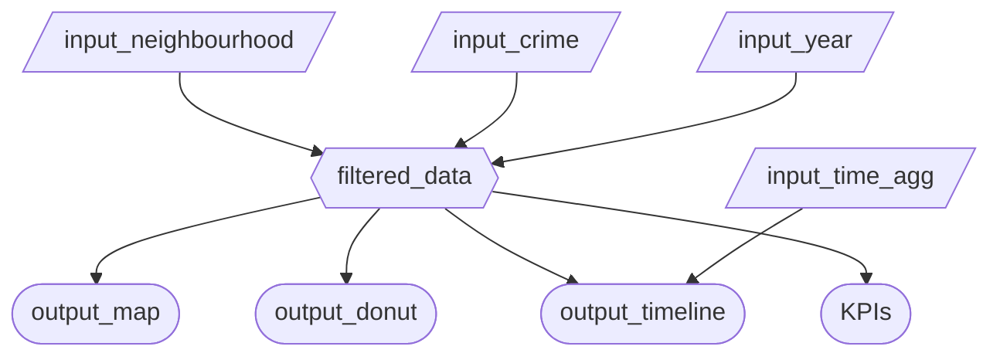

## App Specification

### 1. Updated Job Stories

| #   | Job Story                       | Status         | Notes                         |
| --- | ------------------------------- | -------------- | ----------------------------- |
| 1   | When I … I want to … so I can … | ✅ Implemented |                               |
| 2   | When I … I want to … so I can … | 🔄 Revised     | Changed from X to Y because … |
| 3   | When I … I want to … so I can … | ⏳ Pending M3  |                               |

### 2. Component Inventory

| ID            | Type          | Shiny widget / renderer | Depends on                   | Job story  |
| ------------- | ------------- | ----------------------- | ---------------------------- | ---------- |
| `input_neighbourhood`    | Input         | `ui.input_selectize(multiple=True)` | —                                                       | |
| `input_crime_type`       | Input         | `ui.input_selectize(multiple=True)` | —                                                       |
| `input_year`             | Input         | `ui.input_checkbox_group()`         | —                                                       |
| `input_time_agg`         | Input         | `ui.input_radio_buttons()`          | —                                                       |
| `filtered_data`          | Reactive calc | `@reactive.calc`                    | `input_neighbourhood`, `input_crime_type`, `input_year` |
| `output_map`             | Output        | `@render.ui` (leaflet)              | `filtered_data`                                         |
| `output_donut`           | Output        | `@render.plot`                      | `filtered_data`                                         |
| `output_timeline`        | Output        | `@render.plot`                      | `filtered_data`, `input_time_agg`                       |
| `output_kpi_most_common` | Output        | `@render.text`                      | `filtered_data`                                         |
| `output_kpi_safest_area` | Output        | `@render.text`                      | `filtered_data`                                         |

### 3. Reactivity Diagram

### 4. Calculation Details

We have one `@reactive.calc` in our workflow `filtered_data` which controls all of our charts display. It is the common dataframe of which we show different view to the user.

Depends on:
- Input Year (`input_year : list[str]`): 
    - List of selected years (Checkboxes)
    - The user can select one, two or three years as checkboxes and the dataframe will be filtered accordingly. Thus only the selected years will be displayed across all charts. 
    - Range from 2023-2025
    - default: all
- Input Neighbourhoods (`input_neighbourhood: list[str]`): list of selected neighbourhoods
    - List of selected Neighbourhoods (Multiple Select Dropdown)
    - The user can select one or more neighbourhoods and the dataframe will be filtered accordingly. Thus only the selected neighbourhoods will be displayed across all charts. 
    - Eg. Fairview, Oakridge.
    - default: all
- Input Crime Types (`input_crime : list[str]`): list of selected crime types
    - The user can select one or more crime types and the dataframe will be filtered accordingly. Thus only the selected types will be displayed across all charts. 
    - Eg. Break and Enter Commercial, Theft of Vehicle
    - default: all

Outputs Affected:
- Map `output_map`
    - Shows circles for aggregated total crime (shown using size of circle) in each neighbourhood from `filtered_data`. 
    - Only displays the selected neighbourhoods, crime types and year according to `filtered_df` calculation
- Donut `output_donut`   
    - Distribution of crime for crime type from `filtered_data` after filtration.
- Timeline `output_timeline`
    - Line chart
    - Aggregated crimes for selected years from `filtered_data`: can show data from one, two or three years.
- KPIs: 
    - `output_kpi_most_common` - Display most common crime type from `filtered_data`
    - `output_kpi_safest_area` - Safest neighbourhood displays least total crime from `filtered_data`

> Note: (Not a responsive calc but affects the output display for one chart) The aggregation in `output_timeline` is based on `input_time_agg : str`. Eg. Selecting Weekly aggregation will aggregate ALL Mondays in 2023, ALL Tuesdays in 2023 etc. and give one value
---