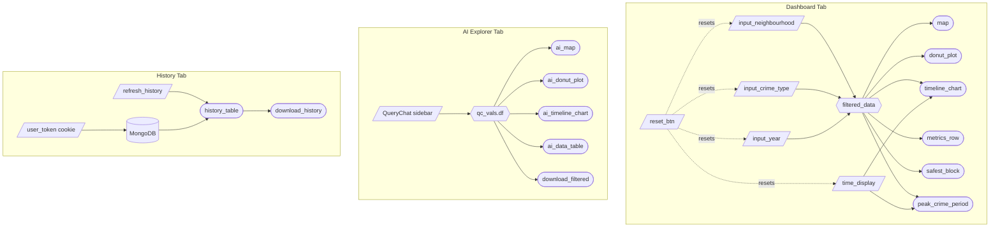

# VanCrimeWatch -- Application Specification

## 1. Overview

VanCrimeWatch is a Shiny for Python dashboard that lets Vancouver residents, business owners, and city planners explore police-reported crime data from 2023 to 2025. It provides spatial, temporal, and categorical breakdowns of crime across the city's 24 neighbourhoods.

The application is organised into three tabs:

| Tab | Purpose |
|---|---|
| **Dashboard** | Interactive map, donut chart, timeline chart, and KPI cards driven by sidebar filters. |
| **AI Explorer** | Natural-language query interface (LLM-powered) with its own map, charts, data table, and CSV download. |
| **My Chat History** | Log of the user's past AI Explorer queries with token/cost metrics. |

---

## 2. Data

| Item | Detail |
|---|---|
| Source | Vancouver Police Department open data (2023 - 2025) |
| Format | Parquet (`data/processed/combined_crime_data_2023_2025.parquet`), loaded lazily via DuckDB through the Ibis framework. A CSV copy is retained for reference. |
| Key columns | `TYPE`, `YEAR`, `MONTH`, `DAY`, `HOUR`, `MINUTE`, `HUNDRED_BLOCK`, `NEIGHBOURHOOD`, `X` (UTM easting), `Y` (UTM northing) |
| Pre-processing | Two collision subtypes (`with Fatality`, `with Injury`) are merged into a single `Vehicle Collision or Pedestrian Struck` category at load time. |
| Crime types | Break and Enter Commercial, Break and Enter Residential/Other, Homicide, Mischief, Offence Against a Person, Other Theft, Theft from Vehicle, Theft of Bicycle, Theft of Vehicle, Vehicle Collision or Pedestrian Struck |
| Neighbourhoods | 24 Vancouver neighbourhoods from Arbutus Ridge to West Point Grey |

---

## 3. Job Stories

| # | Job Story | Status |
|---|---|---|
| 1 | As a **business owner**, I want to filter crimes by neighbourhood so that I can identify which areas of the city are statistically safest for a new storefront. | Implemented |
| 2 | As a **baker** hoping to open a new bakery, I want to filter crimes by type (e.g. Commercial B&E) so that I can avoid areas where my equipment and inventory would be at high risk. | Implemented |
| 3 | As a **visual learner**, I want to view crime data on an interactive map so that I can understand the spatial relationship between potential bakery locations and recent criminal activity. | Implemented |
| 4 | As a baker operating from **mornings to evenings**, I want to view crime trends by time of day, day of week, and month so that I can identify the safest hours, days, and seasons. | Implemented |
| 5 | As a **non-technical user**, I want to query the crime dataset using natural language so that I can ask questions like "top 5 crime types in the West End" without writing code. | Implemented |
| 6 | As a **returning user**, I want to review my past AI Explorer queries so that I can revisit earlier findings without retyping questions. | Implemented |

---

## 4. Component Inventory

### 4.1 Dashboard Tab

#### Inputs

| ID | Widget | Default | Job Story |
|---|---|---|---|
| `input_neighbourhood` | `ui.input_selectize(multiple=True)` | `["Central Business District", "West End"]` | #1 |
| `input_crime_type` | `ui.input_selectize(multiple=True)` | Business crime types (5 types) | #2 |
| `input_year` | `ui.input_checkbox_group()` | `["2025"]` | #3, #4 |
| `time_display` | `ui.input_radio_buttons()` | `"monthly"` | #4 |
| `reset_btn` | `ui.input_action_button()` | -- | #1 - #4 |
| `clear_neighbourhood` | `ui.input_action_link()` | -- | #1 |
| `clear_crime_type` | `ui.input_action_link()` | -- | #2 |
| `mode` | `ui.input_dark_mode()` | `"light"` | -- |

#### Reactive Computations

| ID | Type | Depends On |
|---|---|---|
| `filtered_data` | `@reactive.calc` | `input_neighbourhood`, `input_crime_type`, `input_year` |
| `reset_filters` | `@reactive.effect` + `@reactive.event` | `reset_btn` |
| `_enforce_year_selection` | `@reactive.effect` | `input_year` |
| `clear_neighbourhood` handler | `@reactive.effect` + `@reactive.event` | `clear_neighbourhood` |
| `clear_crime_type` handler | `@reactive.effect` + `@reactive.event` | `clear_crime_type` |

#### Outputs

| ID | Renderer | Data Source | Description | Job Story |
|---|---|---|---|---|
| `map` | `@render_widget` (ipyleaflet) | `filtered_data` | Bubble map with circle markers sized by crime count per neighbourhood. Popup shows neighbourhood name and total. | #1, #3 |
| `donut_plot` | `@render.ui` (Plotly `to_html`) | `filtered_data` | Donut chart showing crime type distribution with percentage labels and central total count. Responsive, no fixed width. | #2 |
| `timeline_chart` | `@render.ui` (Plotly `to_html`) | `filtered_data`, `time_display` | Line chart of crime counts aggregated by month, day-of-week, or hour. One line per selected year. Responsive. | #4 |
| `metrics_row` | `@render.ui` | `filtered_data` | Year-over-year crime totals with percentage change badges (green = decrease, yellow = <5% increase, red = >5% increase). | #1 - #4 |
| `safest_block` | `@render.ui` | `filtered_data` | Displays the neighbourhood with the lowest crime count and its share of total. | #1 |
| `peak_crime_period` | `@render.ui` | `filtered_data`, `time_display` | Shows the peak crime period (month name, weekday, or hour range) based on the selected aggregation. | #4 |

### 4.2 AI Explorer Tab

#### Inputs

| ID | Widget | Description |
|---|---|---|
| QueryChat sidebar | `qc.sidebar(width=400)` | Natural-language chat input powered by Anthropic Claude Haiku. Users type questions; the LLM translates them to SQL against the crime dataset. |
| `download_filtered` | `ui.download_button()` | Export the current AI-filtered dataframe as CSV. |

#### Outputs

| ID | Renderer | Data Source | Description |
|---|---|---|---|
| `ai_map` | `@render_widget` (ipyleaflet) | `qc_vals.df()` | Same bubble map as Dashboard, but driven by AI-filtered data. |
| `ai_donut_plot` | `@render.ui` (Plotly `to_html`) | `qc_vals.df()` | Compact donut chart of AI-filtered crime types. |
| `ai_timeline_chart` | `@render.ui` (Plotly `to_html`) | `qc_vals.df()` | Compact timeline chart of AI-filtered data. |
| `ai_data_table` | `@render.data_frame` | `qc_vals.df()` | Scrollable data table showing the raw AI-filtered records. |

### 4.3 My Chat History Tab

| ID | Renderer | Description |
|---|---|---|
| `history_content` | `@render.ui` | Shows a message or table depending on whether the user has past queries. |
| `history_table` | `@render.data_frame` | Table of past queries with columns: timestamp, user query, generated SQL, tool used, LLM output. |
| `download_history` | `@render.download` | Export full query history as CSV. |
| `refresh_history` | `ui.input_action_button()` | Reload the history table from the MongoDB log. |

---

## 5. Reactivity Diagram



---

## 6. Calculation Details

### 6.1 `filtered_data` (Dashboard)

The central reactive computation for the Dashboard tab. All Dashboard outputs depend on it.

**Inputs:**

| Parameter | Source | Type | Details |
|---|---|---|---|
| Years | `input_year` | `list[str]` | One or more of `"2023"`, `"2024"`, `"2025"`. At least one must be selected; if all are deselected, `_enforce_year_selection` forces the value back to `"2025"` and shows a warning notification. |
| Crime types | `input_crime_type` | `list[str]` | Subset of the 10 crime categories. Empty = show all. |
| Neighbourhoods | `input_neighbourhood` | `list[str]` | Subset of 24 neighbourhoods. Empty = show all. |

**Logic:**
1. Start with the full dataset (loaded lazily via DuckDB/Ibis).
2. Filter rows where `YEAR` matches any selected year.
3. If crime types are selected, filter to those types.
4. If neighbourhoods are selected, filter to those neighbourhoods.
5. Execute the query and return a pandas DataFrame.

**Outputs affected:**
- `map` -- circle markers sized by neighbourhood crime count
- `donut_plot` -- crime type distribution
- `timeline_chart` -- temporal line chart (aggregation controlled by `time_display`)
- `metrics_row` -- year-over-year totals with trend badges
- `safest_block` -- neighbourhood with lowest count
- `peak_crime_period` -- peak time period (aggregation follows `time_display`)

### 6.2 `qc_vals.df()` (AI Explorer)

The QueryChat LLM translates natural-language questions into SQL, runs them against the crime dataset, and returns a filtered DataFrame. All AI Explorer outputs reactively update when the user submits a new query.

QueryChat exposes two tools to the LLM:

| Tool | Behaviour |
|---|---|
| `querychat_query` | Executes a read-only SQL query against the dataset and returns the result to the LLM for summarisation. The dashboard visualisations do not update. |
| `querychat_filter` | Applies a SQL filter to the dataset and updates `qc_vals.df()`, which triggers all AI Explorer outputs (map, donut, timeline, data table) to re-render with the filtered data. |

The LLM is provided with domain-specific instructions (`extra_instructions` in `helpers.py`) that map informal terms to exact column values (e.g. "vandalism" maps to "Mischief", "Downtown" maps to "Central Business District").

### 6.3 LLM Logger

Each AI Explorer query is logged to MongoDB (if `PYMONGO_URI` is set) with: timestamp, user query, generated SQL, tool used, model, LLM output, token counts (input, output, cache read, cache write), estimated cost, and result row count. Users are identified by a persistent browser cookie (`vancrime_user_token`). The History tab displays and allows download of the user's own query log.

---

## 7. Architecture and Technical Details

### 7.1 Data Pipeline

```
CSV (raw) --> prep_data_parquet.py --> Parquet file
                                          |
                                    ibis.duckdb.connect()
                                          |
                                    Lazy filtering (Ibis expressions)
                                          |
                                    .execute() --> pandas DataFrame
```

Parquet + DuckDB enables columnar compression and lazy evaluation. Only the rows/columns needed for a given filter combination are materialised in memory. The DuckDB connection is cleaned up when the user session ends via `session.on_ended(con.disconnect)`.

### 7.2 Chart Rendering

| Chart | Library | Rendering |
|---|---|---|
| Donut chart | Plotly (`plotly.graph_objects`) | `@render.ui` with `fig.to_html(include_plotlyjs=False)`. Plotly JS is loaded once in the page header via CDN to avoid race conditions. |
| Timeline chart | Plotly (`plotly.graph_objects`) | Same HTML-based approach. Supports monthly, weekly (day-of-week), and hourly aggregation. |
| Maps | ipyleaflet | `@render_widget`. Bubble markers sized by `sqrt(count/max_count)`. Coordinates transformed from UTM (EPSG:32610) to WGS84 (EPSG:4326). |

### 7.3 Responsiveness

- All Plotly charts use `autosize=True` with no fixed width, allowing them to fill their container.
- Plotly JS is loaded once in the page `<head>` rather than per-chart to prevent "Plotly is not defined" race conditions.
- A CSS media query removes `max-height` constraints on the AI Explorer tab at viewport widths below 768px, allowing charts to scroll freely on mobile.
- Dashboard layout uses Bootstrap columns (`ui.layout_columns`) that stack vertically on small screens.

### 7.4 File Structure

```
src/
  app.py              Main application: UI layout, server function, reactivity
  donut_chart.py      _make_donut_plot() -- Plotly donut chart builder
  timeline_chart.py   _make_timeline_chart() -- Plotly line chart builder
  map_render.py       _make_map() -- ipyleaflet bubble map builder
  kpi_cards.py        render_kpis() -- KPI card rendering (metrics, safest, peak)
  helpers.py          LLM prompt instructions, filter_crime_data(), UI helpers
  llm_logger.py       MongoDB logging, cookie management, history tab
  styles.css          Custom CSS (dark mode, responsive overrides, KPI styling)
scripts/
  prep_data_parquet.py  One-off script to convert CSV to Parquet via DuckDB
tests/
  test_logic.py       Unit tests for filter_crime_data()
  test_ui.py          Playwright end-to-end tests for dashboard interactions
data/
  processed/          combined_crime_data_2023_2025.parquet (and .csv)
```

---

## 8. Testing

### 8.1 Unit Tests (`tests/test_logic.py`)

The core filtering logic is extracted into `filter_crime_data()` in `helpers.py`, enabling direct unit testing without the Shiny server.

| Test | Assertion |
|---|---|
| `test_filter_empty_years` | Empty year list returns an empty DataFrame with the correct columns. |
| `test_filter_valid_conditions` | Filtering by specific years and crime types returns the correct intersecting rows. |

### 8.2 Playwright UI Tests (`tests/test_ui.py`)

End-to-end tests against the running Shiny app.

| Test | Assertion |
|---|---|
| `test_initial_dashboard_state` | Default year is `["2025"]`, default aggregation is `"monthly"`. |
| `test_filter_changes_update_ui` | Changing filters updates the UI state. |
| `test_reset_button_restores_defaults` | Reset button returns year to `["2025"]`. |
| `test_empty_year_warning` | Deselecting all years triggers a warning and forces year back to `"2025"`. |

### 8.3 Running Tests

```bash
conda activate vancrimewatch
playwright install
pytest tests/
```

---

## 9. Complexity Enhancements

### 9.1 Reset Filters Button

The Reset Filters button (`reset_btn`) restores all four inputs to curated defaults in a single click. Since the defaults are tuned to a business-owner use case (Central Business District + West End, business-relevant crime types, 2025, monthly), the reset provides a meaningful starting view rather than a blank slate.

### 9.2 Year Enforcement Guard

A reactive effect (`_enforce_year_selection`) monitors `input_year`. If the user deselects all years, the guard immediately restores the selection to `["2025"]` and shows a warning notification. This prevents the dashboard from displaying in an empty/broken state.

### 9.3 AI-Powered Natural Language Queries

The AI Explorer tab integrates QueryChat with Anthropic Claude Haiku to translate natural-language questions into SQL. Domain-specific prompt engineering maps informal terms (e.g. "car theft" to "Theft of Vehicle", "Downtown" to "Central Business District") to ensure accurate queries. Results drive a full set of visualisations (map, donut, timeline, data table) identical in structure to the Dashboard.

### 9.4 Query History and Logging

All AI queries are logged to MongoDB with cost and token metrics. Each user is identified by a persistent browser cookie, and the History tab lets users review, refresh, and download their own query logs.

### 9.5 Dark Mode

A global dark/light mode toggle (`ui.input_dark_mode`) in the navbar applies across all tabs. Chart colours are adapted to remain readable in both modes.

---

## 10. Dependencies

| Package | Purpose |
|---|---|
| shiny | Core framework |
| plotly | Donut and timeline charts |
| ipyleaflet / ipywidgets | Interactive maps |
| pandas | Data manipulation |
| ibis-framework[duckdb] | Lazy data loading via Parquet |
| duckdb | Query engine backing Ibis |
| pyproj | UTM to WGS84 coordinate transformation |
| querychat | LLM-powered natural language to SQL |
| chatlas | Chat interface for querychat |
| anthropic | LLM provider (Claude Haiku) |
| pymongo | MongoDB logging for query history |
| python-dotenv | Environment variable management |
| pytest | Unit testing |
| pytest-playwright | End-to-end UI testing |
